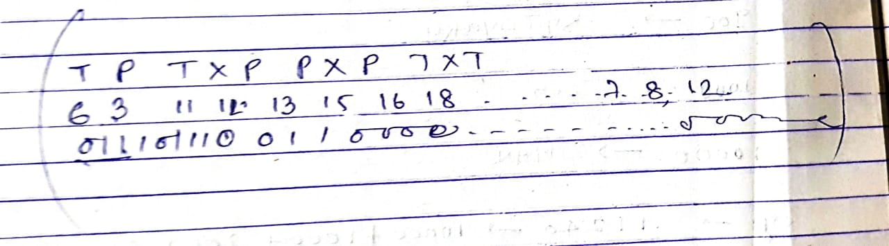

# Final Year Project

# Problem Statemnt 

- Given Some "P" processors and "T" tasks, where tasks are depenedent on each other find the possible traversal of of the tasks using different traversal algorithms

##  Next Phase

- find the nearly optimised solution to achieve the least time out of all algorithms. 

   

 
 
    

 

      

